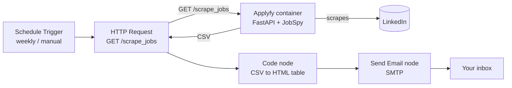

# Applyfy

**Applyfy** is an automated job digest generator. A small FastAPI service scrapes fresh job listings from LinkedIn (via [JobSpy](https://github.com/speedyapply/JobSpy)) and returns them as CSV. A companion [n8n](https://n8n.io/) workflow calls the service on a schedule, turns the CSV into a clean HTML table, and emails it to you as a job digest.

## Table of Contents

- [Features](#-features)
- [How It Works](#-how-it-works)
- [Requirements](#-requirements)
- [Installation](#-installation)
- [Configuration](#-configuration)
- [Setting Up the n8n Workflow](#-setting-up-the-n8n-workflow)
- [API Reference](#-api-reference)
- [Security Notes](#-security-notes)
- [Troubleshooting](#-troubleshooting)
- [Development](#-development)
- [Contributing](#-contributing)
- [License](#-license)

## 🚀 Features

- Scrapes recent LinkedIn job listings by search term, location, number of results, and posting age.
- Returns the results as CSV over a single HTTP endpoint, ready for any automation tool.
- Ready-made n8n workflow ([`flow.json`](flow.json)) that parses the CSV and builds a styled HTML digest (company, title, location, posting date, and job link).
- Sends the digest by email on a weekly schedule, or on demand.
- Fully Dockerized, with multi-arch images (`linux/amd64`, `linux/arm64`) published on Docker Hub.

## 🧠 How It Works



1. The n8n workflow is started by a **Schedule Trigger** (every week) or manually.
2. The **Search for open jobs** HTTP Request node calls the Applyfy container's `/scrape_jobs` endpoint.
3. Applyfy uses JobSpy to scrape LinkedIn and returns the listings as CSV.
4. The **Code** node parses the CSV and renders an HTML digest titled with the current date.
5. The **Send Email** node sends the digest through your SMTP account.

## 📦 Requirements

- Docker and Docker Compose (to run the Applyfy service).
- A running [n8n](https://n8n.io/) instance that can reach the Applyfy container.
- An SMTP account for sending the email (for example, Gmail with an app password).

## 🛠 Installation

### Docker Compose

Create a `docker-compose.yaml` (the same file is included in this repository):

```yaml
services:

  applyfy:
    image: techblog/applyfy
    container_name: applyfy
    restart: always
    networks:
     - infrastructure
    ports:
      - "8111:80"
```

> **Note:** this file attaches the container to a network named `infrastructure`, which is not declared in the file. Either add a top-level `networks:` section (for example, an `external: true` network you already use for n8n) or remove the `networks:` block from the service.

Then start it:

```bash
sudo docker compose up -d
```

The API is now available on port `8111` of the Docker host.

### Docker

```bash
docker run -d --name applyfy --restart always -p 8111:80 techblog/applyfy
```

### Container images

The published image is `techblog/applyfy` on Docker Hub (`linux/amd64`, `linux/arm64`).

The repository also contains a manually triggered workflow that can publish the image to GitHub Container Registry as `ghcr.io/t0mer/applyfy` (`linux/amd64`, `linux/arm64`, `linux/arm/v7`), but no GHCR image has been published yet.

### Build from source

```bash
git clone https://github.com/t0mer/Applyfy.git
cd Applyfy
docker build -t applyfy .
docker run -d -p 8111:80 applyfy
```

## 🔧 Configuration

The service has no environment variables or configuration files. All search options are passed as query parameters on each request (see [API Reference](#-api-reference)).

| Setting | Value | Notes |
|---------|-------|-------|
| Listening port (inside the container) | `80` | Fixed in `app/app.py`; map it to any host port (the examples use `8111`). |
| Bind address | `0.0.0.0` | Fixed in `app/app.py`. |
| Job source | LinkedIn | Fixed in `app/app.py` (`site_name=["linkedin"]`). |
| Volumes | none | The service is stateless. |

## 🔁 Setting Up the n8n Workflow

The workflow is stored in [`flow.json`](flow.json). To import it, create a new workflow in n8n and either use **Import from File** with `flow.json`, or copy its contents and paste them into the canvas.

<details>
<summary>Show the workflow JSON</summary>

```json
{
  "name": "Job Finder",
  "nodes": [
    {
      "parameters": {},
      "type": "n8n-nodes-base.manualTrigger",
      "typeVersion": 1,
      "position": [
        -520,
        -160
      ],
      "id": "de683bec-3fa0-4cb4-b45f-b39dbe04ad35",
      "name": "When clicking ‘Test workflow’"
    },
    {
      "parameters": {
        "fromEmail": "example@gmail.com",
        "toEmail": "example@gmail.com",
        "subject": "=📌 Top Job Opportunities — Updated  {{ $json.subjectDate }}",
        "html": "={{ $json.html }}",
        "options": {}
      },
      "type": "n8n-nodes-base.emailSend",
      "typeVersion": 2.1,
      "position": [
        120,
        -160
      ],
      "id": "ea44caab-4042-4716-a05f-56dc401d3a50",
      "name": "Send Email",
      "webhookId": "9e8056a2-ee4b-44ed-b568-a92e3b503d87",
      "credentials": {
        "smtp": {
          "id": "cTa1cY2qr9SqODB0",
          "name": "Gmail account"
        }
      }
    },
    {
      "parameters": {
        "url": "[server_url]/scrape_jobs",
        "sendQuery": true,
        "queryParameters": {
          "parameters": [
            {
              "name": "search_term",
              "value": "Senior Devops"
            },
            {
              "name": "location",
              "value": "Raanana, Israel"
            },
            {
              "name": "results_wanted",
              "value": "40"
            },
            {
              "name": "hours_old",
              "value": "72"
            },
            {
              "name": "country_indeed",
              "value": "ISRAEL"
            }
          ]
        },
        "options": {}
      },
      "type": "n8n-nodes-base.httpRequest",
      "typeVersion": 4.2,
      "position": [
        -300,
        -160
      ],
      "id": "0dab0f2b-f187-43d1-aa06-5070b7de7348",
      "name": "Search for open jobs"
    },
    {
      "parameters": {
        "rule": {
          "interval": [
            {
              "field": "weeks"
            }
          ]
        }
      },
      "type": "n8n-nodes-base.scheduleTrigger",
      "typeVersion": 1.2,
      "position": [
        -540,
        60
      ],
      "id": "7e652305-fde8-467a-b202-0d535dfc9a8e",
      "name": "Schedule Trigger"
    },
    {
      "parameters": {
        "jsCode": "const rawCsv = items[0].json.data;\n\n// Parse CSV\nconst lines = rawCsv.trim().split('\\n');\nconst headers = lines[0].replace(/^\"|\"$/g, '').split('\",\"');\nconst jobs = lines.slice(1).map(line => {\n  const cols = line.replace(/^\"|\"$/g, '').split('\",\"');\n  const obj = {};\n  headers.forEach((h, i) => obj[h] = cols[i] || '');\n  return obj;\n});\n\n// Friendly title date\nconst options = { year: 'numeric', month: 'long', day: 'numeric' };\nconst currentDate = new Date().toLocaleDateString('en-US', options);\n\n// Build job rows\nconst htmlRows = jobs.map(job => `\n  <tr>\n    <td>${job.company}</td>\n    <td>${job.title}</td>\n    <td>${job.location}</td>\n    <td>${job.date_posted}</td>\n    <td><a href=\"${job.job_url}\" target=\"_blank\">View Job</a></td>\n\n  </tr>\n`).join('');\n\n// Final HTML\nconst html = `\n<html>\n  <head>\n<style>\n  body {\n    font-family: 'Segoe UI', Tahoma, Geneva, Verdana, sans-serif;\n    background-color: #f7f9fc;\n    color: #333;\n    margin: 0;\n    padding: 0;\n  }\n  .container {\n    max-width: 1200px;\n    margin: auto;\n    background: #ffffff;\n    padding: 30px;\n    border-radius: 10px;\n    box-shadow: 0 2px 12px rgba(0,0,0,0.06);\n  }\n  h2 {\n    text-align: center;\n    color: #1a73e8;\n    margin-top: 0;\n    font-size: 24px;\n  }\n  table {\n    width: 100%;\n    border-collapse: separate;\n    border-spacing: 0;\n    margin-top: 25px;\n    font-size: 14px;\n  }\n  th {\n    background-color: #e6f2ff;\n    color: #333;\n    padding: 14px 12px;\n    border: 1px solid #ccc;\n    text-align: left;\n  }\n  td {\n    padding: 12px;\n    border: 1px solid #ddd;\n    background-color: #fff;\n    vertical-align: top;\n  }\n  tr:hover td {\n    background-color: #f0f8ff;\n  }\n  tr:first-child th:first-child {\n    border-top-left-radius: 8px;\n  }\n  tr:first-child th:last-child {\n    border-top-right-radius: 8px;\n  }\n  tr:last-child td:first-child {\n    border-bottom-left-radius: 8px;\n  }\n  tr:last-child td:last-child {\n    border-bottom-right-radius: 8px;\n  }\n  a {\n    color: #1a73e8;\n    text-decoration: none;\n  }\n  a:hover {\n    text-decoration: underline;\n  }\n  .footer {\n    margin-top: 35px;\n    text-align: center;\n    font-size: 12px;\n    color: #777;\n  }\n</style>\n  </head>\n  <body>\n    <div class=\"container\">\n      <h2>📌 Top Job Opportunities — Updated ${currentDate}</h2>\n      <table>\n        <thead>\n          <tr>\n            <th>Company</th>\n            <th>Title</th>\n            <th>Location</th>\n            <th>Posted</th>\n            <th>Job URL</th>\n\n          </tr>\n        </thead>\n        <tbody>\n          ${htmlRows}\n        </tbody>\n      </table>\n      <div class=\"footer\">\n        This summary was generated automatically. Stay sharp and happy job hunting!\n      </div>\n    </div>\n  </body>\n</html>\n`;\n\n\n// (add to final return)\nreturn [{\n  json: {\n    html: html,\n    subjectDate: currentDate  // ← this is new\n  }\n}];"
      },
      "type": "n8n-nodes-base.code",
      "typeVersion": 2,
      "position": [
        -80,
        -160
      ],
      "id": "fa76d1f8-b4a2-4a6d-9a50-1206c0dcd7ee",
      "name": "Code"
    }
  ],
  "pinData": {},
  "connections": {
    "When clicking ‘Test workflow’": {
      "main": [
        [
          {
            "node": "Search for open jobs",
            "type": "main",
            "index": 0
          }
        ]
      ]
    },
    "Search for open jobs": {
      "main": [
        [
          {
            "node": "Code",
            "type": "main",
            "index": 0
          }
        ]
      ]
    },
    "Schedule Trigger": {
      "main": [
        [
          {
            "node": "Search for open jobs",
            "type": "main",
            "index": 0
          }
        ]
      ]
    },
    "Code": {
      "main": [
        [
          {
            "node": "Send Email",
            "type": "main",
            "index": 0
          }
        ]
      ]
    }
  },
  "active": false,
  "settings": {
    "executionOrder": "v1"
  },
  "versionId": "ce8735c2-574e-4802-938a-38d01b827199",
  "meta": {
    "templateCredsSetupCompleted": true,
    "instanceId": "ee0b1e6cae70ad46e056ec4fd2977de5edc839fb7e2c0e493527d90ecdb65056"
  },
  "id": "oCzjHb3K1XaBGew7",
  "tags": []
}
```

</details>

The workflow contains these nodes:

| Node | Type | Purpose |
|------|------|---------|
| When clicking ‘Test workflow’ | Manual Trigger | Run the workflow on demand. |
| Schedule Trigger | Schedule Trigger | Run the workflow once a week. |
| Search for open jobs | HTTP Request | Calls `GET /scrape_jobs` on the Applyfy container. |
| Code | Code (JavaScript) | Parses the CSV and builds the HTML digest and the subject date. |
| Send Email | Send Email (SMTP) | Emails the digest. |

### Edit the following parameters in the HTTP Request node

- Set the URL to your container address, for example `http://<server>:8111/scrape_jobs` (replace the `[server_url]` placeholder).
- Set `search_term` to the job you are looking for.
- Set `location`.
- Set `hours_old` to limit results to jobs posted within that many hours.
- Set `results_wanted` to the number of results to return.
- Keep `country_indeed` and set it to a valid JobSpy country name, for example `ISRAEL` (see [API Reference](#-api-reference)).

### Edit the Send Email node

- Set **From Email**.
- Set **To Email**.
- Set the SMTP account credentials.

> **Note:** if you want to use a Gmail account, you must enable 2-Step Verification and create an app password.

Run the workflow, and you should get an email that looks like this:


## 📡 API Reference

### `GET /scrape_jobs`

Scrapes LinkedIn and returns the matching jobs as CSV (`Content-Type: text/plain`). All parameters are required.

| Parameter | Type | Description |
|-----------|------|-------------|
| `search_term` | string | Job title or keywords, for example `Senior Devops`. |
| `location` | string | Location to search, for example `Raanana, Israel`. |
| `results_wanted` | integer | Number of results to return. |
| `hours_old` | integer | Only return jobs posted within this many hours. |
| `country_indeed` | string | Country passed to JobSpy, for example `ISRAEL`. It must be a valid JobSpy country name: JobSpy parses it on every call (even for LinkedIn), and an unknown value causes an HTTP 500. JobSpy also uses it for salary extraction, which only applies to `USA`. |

Example:

```bash
curl -G "http://localhost:8111/scrape_jobs" \
  --data-urlencode "search_term=Senior Devops" \
  --data-urlencode "location=Raanana, Israel" \
  --data-urlencode "results_wanted=40" \
  --data-urlencode "hours_old=72" \
  --data-urlencode "country_indeed=ISRAEL"
```

The response is the JobSpy result table in CSV form, with a header row. Text values are quoted. The n8n Code node uses the `company`, `title`, `location`, `date_posted`, and `job_url` columns.

FastAPI also serves its default interactive documentation at `/docs` and the OpenAPI schema at `/openapi.json`.

## 🔒 Security Notes

- The API has no authentication. Do not expose it to the internet; keep it on a private network that only your n8n instance can reach.
- Store the SMTP password in n8n credentials, not in the workflow JSON. For Gmail, use an app password rather than your account password.
- Scraping LinkedIn may be subject to LinkedIn's terms of service and rate limits. Keep `results_wanted` and the schedule reasonable.

## 🩺 Troubleshooting

- **`service "applyfy" refers to undefined network infrastructure`**: the bundled `docker-compose.yaml` references a network it does not declare. See the note under [Docker Compose](#docker-compose).
- **HTTP 422 from `/scrape_jobs`**: one of the five query parameters is missing or not a valid integer. All of them, including `country_indeed`, are required.
- **HTTP 500 (`Internal Server Error`) from `/scrape_jobs`**: JobSpy raised an error that the service does not catch. The most common cause is an invalid `country_indeed` value; use a valid JobSpy country name such as `ISRAEL` or `USA`. Check the container logs (`docker logs applyfy`) for the exact error.
- **n8n cannot reach the service**: make sure the HTTP Request node URL uses the host and port that n8n can reach (the host port, `8111` in the examples, or the container name and port `80` when both containers share a Docker network).
- **Email is not sent from Gmail**: Gmail requires 2-Step Verification and an app password for SMTP.

## 💻 Development

Project layout:

```
app/app.py            FastAPI service (single /scrape_jobs endpoint)
flow.json             n8n workflow
requirements.txt      Python dependencies (fastapi, uvicorn, pandas, python-jobspy)
Dockerfile            Image based on python:3.11-slim
docker-compose.yaml   Example Compose deployment
screenshots/          README images
.github/workflows/    Manual image publishing workflows (Docker Hub, GHCR)
```

Run locally without Docker (the app listens on port 80, which may need elevated privileges):

```bash
pip install -r requirements.txt
cd app
python app.py
```

The Docker Hub image (`techblog/applyfy`) is published by the manually triggered **Docker Build** GitHub Actions workflow. A second manual workflow, **Publish to GHCR**, can publish `ghcr.io/t0mer/applyfy`, but it has not been run yet.

## 🤝 Contributing

Issues and pull requests are welcome. Please open an issue first to discuss larger changes.

## 📄 License

This project is licensed under the Apache License 2.0. See [LICENSE](LICENSE) for details.
